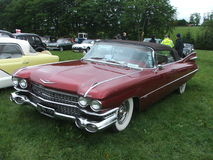
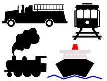

<h1 align='center'>Dobot Image Classifier</h1>

  

Dobot Image Classifier is a project done in collaboration with Dobot Inc., a Denver startup, with the purpose of helping users determine appropriate savings goals based on images users upload to represent their savings goals. The way that Dobot's app works is that a user joins, links their bank account, and creates savings goals by uploading an image and specifying a specific monetary amount for the savings goal. Dobot then uses the users account information to determine small amounts of money to periodically remove from a users checking account and place into a savings account based on their spending habits and income.

## Goal

The goal of this project is to classify images that users upload to represent their savings goals in order to better understand what users savings goals are, and therefore better help the users meet their goals.

## Motivations

My interest in completing this project largely arose from two factors. First American's savings habits have become pretty abysmal as this point, with people spending more and saving less than they traditionally have. For example, according to a survey conducted by GOBankingRates.com, 62% of Americans have less than $1000 in savings and 21% don't even have a savings account. If these results are accurate, this obviously has huge ramifications for the future of the US as the younger generations with these poor spending habits get older and may no longer be able to work.

Second, before decided to focus full time on data science, I was in the field of neuroscience research. Due to my experience trying to understand how the brain works, I think the idea of a method of analysis that is based on how neurons in the central nervous system communicate is really interesting and so I wanted to broaden my understanding of neural nets and practice implementing them.

## Tools

I used several different tools for this project. The coding language I used with Python, and I used Amazon Web Services for computing and storage. I have layed out more specifically the tools below:

##### Computing
  - AWS EC2

##### Storage
  - AWS S3

##### Scraping
  - BeautifulSoup

##### Processing
  - Numpy
  - Pandas
  - SciKit-Image

##### Neural Nets
  - Keras
  - Theano

## Scraping [[code]](scraper.py)

The first step of my project was getting a training set from which to train my model. Next I had to decide which categories to use to train my model. Based on the data that I got from Dobot, I settled on the following five:
  - Car expenses
  - Home expenses
  - Special events
  - General savings
  - Travel

Next I began looking at places to scrape from. My goal was to get around 100,000 images per category since I expected a fair amount of leakage between groups and because neural nets are notoriously expensive to train. I was able to find a stock photo site that I could get roughly 10,000 images per keyword so I next came up with 10-15 subcategory keywords for each category to scrape from. I then scraped each keyword, running my code on an AWS EC2 instance and saving the results into AWS S3 buckets.

#### Good Examples of Category Images

For the most part, the images I were able to get were pretty good. Below are some examples of images that fit well in their respective categories:

##### Car Expenses

 

##### Home Expenses

 

##### Special Events

 

##### General Savings

 

##### Travel

 

#### Bad Examples of Category Images

Unfortunately, considering how broad the categories were and the number of images I needed for each one to train the nets, there were also a lot of images that did not fit as well into their categories or that would have fit in just as well if not better in another category. I have included some examples of these below:

##### Car Expenses

 

##### Home Expenses

 

##### Special Events

 

##### General Savings

 

##### Travel

 

## Processing [[code]](image_processing.py)

Once I had all my images scraped, I needed to process them. To do this I down sampled each to photo to 50x50 and 100x100 pixels to standardize the shape of each photo and to see how much of an effect the size of each photo would have on my models. I also took each of these 50x50 and 100x100 arrays for each photo and broke them into another dimension so that each image was represented by a 3x50x50 and 3x100x100 arrays with the top dimension representing the red, blue and green pixel values for each pixel. To do this processing I used Python's SciKit-Image library. I again used an EC2 AWS machine to run the program and again saved the images that I scraped in AWS S3 buckets.

## Convolutional Neural Net [[neural net code]](CNN.py) [[train/test model code]](fit_models.py)

Once all my images were processed I used them to train the neural nets. I wanted to try a couple of different models for my task. After some research I decided on the 16 and 19 layered VGG convolutional Neural Nets. Each of which have 5 convolutional layers with a max pooling step between each one and 3 dense fully connected layers. I batch trained each network to account for the massive size of the training set which ended up being around 400,000 images. I ran the nets on GPU optimized AWS EC2 instances in order to reduce the runtime on training the models. I used the Keras python library with the Theanos backend to build the models. Unfortunately, due to the massive size of both the training set and the model itself. Unfortunalely I didn't have the extensive resources necessary to train the 16 and 19 layered models For instance it was taking me roughly 8 days to train those models on a an AWS GPU optimized EC2 instance, and at about $2.60 an hour, the costs add up very quickly. Therefore I made a much smaller net with only 2 convolutional layers and 2 dense layers. While this net still took me roughly 8 hours to train, that is still much more reasonable than 8 days.

 

## Results

My 2-layer convolutional net trained and validated on the images down-sampled to 50x50 pixels correctly identified the images with 48% accuracy. While a higher accuracy would obviously be better, considering the overlap between the categories, I think the net was overall successful. Moving forward I intend to train with more iterations utilizing different optimizers and different learning rates and batch sizes. I also intend to test different types of neural net models such as recurrent neural networks or long term short term memory (LSTM) neural networks.
